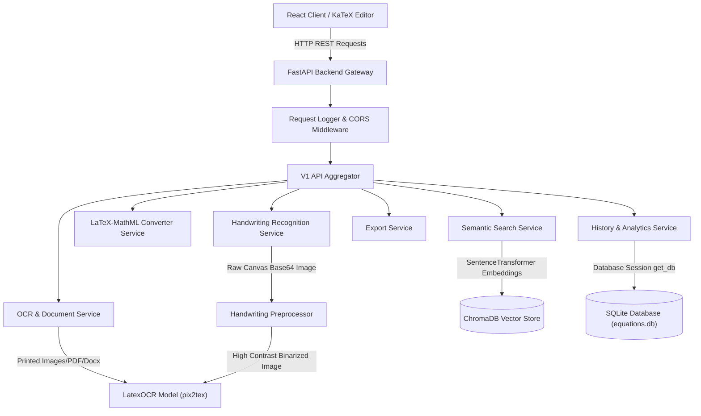

# 🧮 EquationAI

[](https://www.python.org)
[](https://fastapi.tiangolo.com)
[](https://react.dev)
[](https://tailwindcss.com)
[](https://www.trychroma.com)
[](https://opensource.org/licenses/MIT)

EquationAI is an **AI-Powered Mathematical Equation Processing Platform** designed to bridge the gap between physical math documents, handwritten notes, and digital markup formats. The system allows users to ingest printed equations from images and files, transcribe handwritten sketches, translate back-and-forth between LaTeX and MathML, query formulas using a semantic vector search engine, and manage processed equation histories with advanced analytics.

---

## 📖 Table of Contents

- [Problem Statement](#problem-statement)
- [Objectives](#objectives)
- [Features & Functionalities](#features--functionalities)
- [System Architecture](#system-architecture)
- [Tech Stack Used](#tech-stack-used)
- [Project Folder Structure](#project-folder-structure)
- [How the System Works](#how-the-system-works)
- [Dataset & Model Training](#dataset--model-training)
- [API Endpoints](#api-endpoints)
- [Installation & Setup Instructions](#installation--setup-instructions)


---

## 🚨 Problem Statement

Mathematical equations are a foundational pillar of academic, scientific, and engineering literature. However, they present significant challenges in the digital landscape:
1. **Typesetting Overhead**: Manually writing LaTeX or MathML syntax for complex equations (such as matrices, calculus integrations, or multi-line derivations) is slow, error-prone, and requires specialized knowledge.
2. **Inaccessibility of Scans**: Mathematical formulas trapped inside scanned textbooks, papers (PDFs), or pictures (PNGs/JPEGs) cannot be easily copied, edited, or dynamically rendered on the web.
3. **Ineffective Search Engines**: Standard keyword-based search engines cannot parse semantic relations or structural layout characteristics of mathematical formulas. Searching for expressions mathematically similar to $a^2 + b^2 = c^2$ yields poor results.
4. **Drawing Digitization**: Translating handwritten chalkboard work or whiteboard sketches of math formulas directly into digital web elements remains a manual, multi-step chore.

---

## 🎯 Objectives

The core objectives of EquationAI are to:
- **Automate Extraction**: Implement deep learning-based Optical Character Recognition (OCR) to extract mathematical equations from images and text-based documents (PDF, DOCX).
- **Simplify Conversion**: Provide bidirectional conversion between LaTeX (standard document typesetting) and MathML (web rendering format) with real-time visual syntax verification.
- **Support Drawing Digitization**: Build an interactive drawing canvas with advanced image preprocessing to parse and digitize handwritten equations on-the-fly.
- **Enable Semantic Math Lookup**: Create a hybrid semantic search engine using local vector database embeddings to query mathematical formulas by natural language terms, categories, or equation syntax.
- **Track Logs & Analytics**: Deliver user-focused history tracking, PDF/LaTeX/MathML exporting, and analytics summarizing processed equations by mathematical disciplines (Algebra, Calculus, Physics, etc.).

---

## ✨ Features & Functionalities

*   **📄 Intelligent File & OCR Processor**:
    *   Accepts images (`.png`, `.jpg`, `.jpeg`) and documents (`.pdf`, `.docx`).
    *   Applies OCR extraction powered by local `pix2tex` deep learning models.
    *   For PDF/DOCX files, attempts native XML text extraction first, with automated image-rendering and OCR fallback.
*   **✍️ Handwriting Sketch Canvas**:
    *   Free-hand drawing board to sketch mathematical formulas.
    *   Custom image preprocessing pipeline: alpha-transparency flattening, adaptive binarization thresholding, morphological noise filters, auto-bounding box cropping, and Lanczos aspect-ratio scaling.
*   **🔄 Bidirectional Markup Converter**:
    *   Real-time conversion of **LaTeX to MathML** and **MathML to LaTeX**.
    *   Syntax validation engine analyzing token matches, balance of brackets, and missing operations.
    *   Interactive preview using KaTeX for crisp mathematical rendering.
*   **🔍 Hybrid Semantic Search**:
    *   Vector database queries that retrieve equations matching both structural formulas and textual concepts.
    *   Combines `SentenceTransformers` embeddings with token-based Jaccard similarity indices for precise matching.
*   **📈 Dashboard & History Analytics**:
    *   Visual representation of processed equations classified into categories (e.g., *Calculus*, *Algebra*, *Trigonometry*, *Geometry*, *Physics*, *Complex Analysis*).
    *   Detailed processing-time metrics and historical logs.
*   **💾 Multi-Format Exporter**:
    *   Download individual equations as `.tex` (LaTeX) source code, `.mml` (MathML) files, or as compiled `.pdf` reports detailing classification metadata and formulas.

---

## 🏗️ System Architecture

EquationAI is designed around a multi-tier client-server structure:



### Architectural Highlights
1. **Frontend**: A Single Page Application (SPA) utilizing Vite, React 19, and Tailwind CSS. Renders mathematical expressions in real-time using KaTeX.
2. **Backend Services**: Layered FastAPI structure separating routing controllers, request schemas (Pydantic), data models (SQLAlchemy), and service engines.
3. **Database Layer**: Dual database design utilizing SQLite (with Write-Ahead Logging `WAL` mode enabled for concurrency) for transactional/history data and ChromaDB for vector storage.

---

# 🛠️ Tech Stack Used

EquationAI leverages a carefully selected set of programming languages, libraries, and frameworks:

### Frontend
- React 19
- Vite
- Tailwind CSS v4
- KaTeX
- Axios

### Backend
- Python 3.11+
- FastAPI
- Pydantic
- SQLAlchemy
- Alembic

### Artificial Intelligence & Machine Learning
- pix2tex (LatexOCR)
- SentenceTransformers
- all-MiniLM-L6-v2

### Databases
- SQLite
- ChromaDB

### Image & Document Processing
- Pillow (PIL)
- NumPy
- PyMuPDF (fitz)
- python-docx

### Authentication & Security
- JWT Authentication
- python-jose
- passlib (bcrypt)

### Export & Reporting
- fpdf2
- LaTeX
- MathML

### DevOps & Deployment
- Docker
- Docker Compose
- Git & GitHub

---

## 📂 Project Folder Structure

```
Final Project/
├── backend/
│   ├── app/
│   │   ├── api/                 # Endpoint routers
│   │   │   └── v1/              # Version 1 API (Auth, OCR, Search, etc.)
│   │   ├── core/                # Middleware, Logging, Exception managers
│   │   ├── models/              # SQLAlchemy relational models
│   │   ├── schemas/             # Pydantic serialization classes
│   │   ├── services/            # Core business logic handlers
│   │   │   ├── ocr_service.py   # LatexOCR integration
│   │   │   ├── search_service.py# Search wrapper
│   │   │   └── export_service.py# PDF, LaTeX, MathML exporter
│   │   ├── vector_db/           # Vector database files & Chroma config
│   │   ├── config.py            # Environment configurations (Pydantic Settings)
│   │   ├── database.py          # SQLite engine and session configurations
│   │   └── main.py              # Application factory creation
│   ├── data/                    # SQLite databases (.db)
│   ├── logs/                    # Backend logs (equationai.log)
│   ├── migrations/              # Alembic database migrations
│   ├── uploads/                 # Temporary uploaded files
│   ├── Dockerfile               # Container build file
│   ├── docker-compose.yml       # Docker compose orchestration definition
│   ├── requirements.txt         # Python dependency manifest
│   ├── run.py                   # Development runner
│   └── main.py                  # Legacy monolith server
└── frontend/
    ├── src/
    │   ├── api/                 # Axios clients and REST request wrappers
    │   ├── components/          # Shared layout components (Sidebar, Loading)
    │   ├── layouts/             # Dashboard and Shell layouts
    │   ├── pages/               # Main pages (Home, OCR, Handwriting, Search)
    │   │   ├── Converter.jsx    # Real-time LaTeX-MathML editor
    │   │   ├── Handwriting.jsx  # Interactive canvas drawing page
    │   │   ├── Search.jsx       # Semantic search interface
    │   │   └── Upload.jsx       # Document and Image uploading dashboard
    │   ├── routes/              # Routing configurations
    │   ├── App.jsx              # Application component
    │   └── index.css            # Base Tailwind and global custom styles
    ├── public/                  # Static assets
    ├── package.json             # NPM dependencies
    └── vite.config.js           # Vite server configurations
```

---

## ⚙️ How the System Works

Here is a step-by-step description of the internal pipelines:

### 1. The OCR Document Pipeline
1. **Ingestion**: A user uploads an image, PDF, or DOCX document via the React client.
2. **Text Parsing**: The backend checks for text elements inside PDF/DOCX using `PyMuPDF` or `python-docx`. If equations are embedded as plain mathematical text, they are extracted directly.
3. **OCR Fallback**: If no plain text is found, PDF pages are converted into images using `fitz.Matrix` and processed via OCR.
4. **Model Inference**: The `LatexOCR` model (`pix2tex`) takes the preprocessed image and generates LaTeX string tokens.
5. **Classify & Index**: The LaTeX is classified (e.g., Calculus) and indexed into ChromaDB.
6. **Save History**: The results are saved into the SQLite database.

### 2. Handwriting Recognition Pipeline
```
[Canvas Sketch] ➔ [Flatten Alpha (White BG)] ➔ [Grayscale] ➔ [Adaptive Binarize] ➔ [Auto-Crop] ➔ [Resize to 200px] ➔ [Add 30px Padding] ➔ [LatexOCR]
```
- **Canvas Capture**: The drawing canvas returns a raw transparent PNG base64 string.
- **Image Preprocessing**:
  - `_flatten_alpha`: Transparency is removed and flattened against a solid white background.
  - `_ensure_dark_on_white`: Auto-inverts colors to ensure dark ink on a light background.
  - `_binarize`: Thresholds pixels under $180$ grayscale to pure black ($0$) and others to pure white ($255$).
  - `_auto_crop`: Scans coordinates of ink, crops to bounding box, and clamps padding.
  - `_resize_to_target`: Resizes the cropped element to exactly $200\text{px}$ height.
- **Model Inference**: The processed high-contrast image is sent to the OCR model for conversion into LaTeX.

### 3. Hybrid Semantic Search Pipeline
- **Vector Indexing**: During server startup (or when a new equation is processed), ChromaDB is seeded with a baseline dataset. A text document representation (`{equation} {category} {explanation} {tags}`) is converted into a $384$-dimensional embedding using the `SentenceTransformer` and stored in ChromaDB.
- **Search Query Execution**:
  1. The user types a query (e.g., `"pythagorean"` or `"a^2 + b^2"`).
  2. The query is embedded and compared against vectors inside ChromaDB.
  3. Parallel to vector search, Jaccard character-set similarity scoring is run against the seeded formulas to ensure exact matches or slight syntax variations score highly.
  4. The system merges the results, resolves duplicates, and sorts them by similarity score.

---

## 📊 Dataset & Model Training

### OCR Model (`pix2tex`)
*   **Architecture**: Vision Transformer (`ViT`) encoder and a standard sequence-to-sequence Transformer decoder.
*   **Training Set**: Trained on the **im2latex-100k** dataset containing over $100,000$ images of compiled LaTeX equations paired with their corresponding LaTeX source strings.
*   **Loss Function**: Trained utilizing categorical cross-entropy loss against LaTeX syntax tokens.

### Embeddings and Vector Search Data
*   **Base Embeddings Model**: `all-MiniLM-L6-v2` trained on over 1 billion sentence pairs for semantic similarity.
*   **Local Index**: The local vector collection is seeded with core formulas spanning physics equations, probability models, algebra formulas, calculus integrals, and trigonometry identities.

---

## 🌐 API Endpoints

### Health & Analytics
*   `GET /api/v1/health` - Simple health confirmation.
*   `GET /api/v1/health/detailed` - Reports SQLite connection status, vector database availability, and whether the ML model is loaded.
*   `GET /api/v1/stats` - Returns calculations on equations processed, category percentages, and history counts.

### Conversion & OCR
*   `POST /api/v1/upload` - Processes file uploads (`multipart/form-data`) with image or document bytes. Returns LaTeX, MathML, similarity comparisons, and processing times.
*   `POST /api/v1/convert/latex-to-mathml` - Accepts JSON payload `{"latex": "..."}` and returns MathML code with real-time visual grammar verification.
*   `POST /api/v1/convert/mathml-to-latex` - Translates a MathML input string back into clean LaTeX markup.
*   `POST /api/v1/handwriting/recognize` - Parses base64 handwritten drawings: `{"image": "data:image/png;base64,..."}`.

### Semantic Search & History
*   `POST /api/v1/semantic-search` - Performs hybrid query mapping on a search term.
*   `GET /api/v1/history` - Fetches paginated list of all conversions, uploads, search queries, and drawings.
*   `DELETE /api/v1/history/{entry_id}` - Deletes a specific history item.
*   `DELETE /api/v1/history` - Clears the database history logs.

### Exports
*   `POST /api/v1/export/latex` - Generates a downloadable `.tex` attachment of the equation.
*   `POST /api/v1/export/mathml` - Generates a downloadable XML `.mml` file.
*   `POST /api/v1/export/pdf` - Compiles a premium PDF analytical report page including LaTeX representations, MathML markup, timestamp, category, and explanation.

---

## 🚀 Installation & Setup Instructions

### Prerequisites
Make sure you have the following installed on your machine:
*   [Python 3.11+](https://www.python.org/downloads/)
*   [Node.js 18+](https://nodejs.org/)
*   [Docker](https://www.docker.com/) (Optional, for containerized deployments)

---

### Method 1: Local Development Setup

#### 1. Setup Backend Server
Open a terminal and navigate to the backend directory:
```bash
cd backend
```

Copy the environment file template and configure variables:
```bash
cp .env.example .env
```

Create a virtual environment and activate it:
```bash
# Windows
python -m venv venv
.\venv\Scripts\activate

# macOS/Linux
python3 -m venv venv
source venv/bin/activate
```

Install the dependencies:
```bash
pip install --upgrade pip
pip install -r requirements.txt
```

Run the FastAPI backend server:
```bash
python run.py
```
> [!NOTE]
> The backend server will start at `http://localhost:8000`. Swagger API documentation will be available at `http://localhost:8000/docs`.

---

#### 2. Setup Frontend Client
Open a new terminal and navigate to the frontend directory:
```bash
cd frontend
```

Install the Node modules:
```bash
npm install
```

Configure your environment variables:
Create a `.env` file in the frontend folder containing:
```env
VITE_API_BASE_URL=http://localhost:8000/api
VITE_APP_NAME=EquationAI
```

Run the Vite development server:
```bash
npm run dev
```
> [!NOTE]
> The client web application will start at `http://localhost:5173`.

---

### Method 2: Containerized Deployment (Docker)

To run the entire ecosystem inside isolated containers, navigate to the backend folder containing the docker orchestration details:

```bash
cd backend
docker-compose up --build
```
This builds the base image containing system-level requirements (`poppler-utils` for PDF page renderings, `build-essential`), installs dependencies, runs database migrations, and exposes the FastAPI service on port `8000`.
